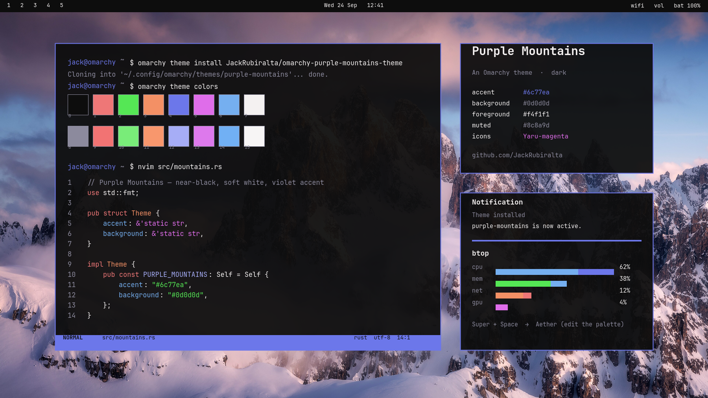

# Purple Mountains

A dark [Omarchy](https://omarchy.org) theme: near-black surfaces, soft white text and a violet-blue accent lifted from the purple-mountains wallpaper. Built with Aether, packaged as a standalone theme.



## Install

```sh
omarchy theme install https://github.com/JackRubiralta/omarchy-purple-mountains-theme
```

Or in Omarchy: **Super + Alt + Space → Install → Style → Theme** and paste the URL above. The theme shows up as **purple-mountains** in the theme switcher.

## Palette

| Role | Hex | | Role | Hex |
|---|---|---|---|---|
| background | `#0d0d0d` | | accent | `#6c77ea` |
| foreground | `#f4f1f1` | | selection | `#2c3040` |
| muted | `#8c8a9d` | | lighter background | `#252525` |
| red | `#ee7777` | | bright red | `#f27373` |
| green | `#55e755` | | bright green | `#79ec79` |
| yellow | `#f39065` | | bright yellow | `#f8976d` |
| blue | `#6c77ea` | | bright blue | `#a6adf6` |
| magenta | `#df6dea` | | bright magenta | `#dd79ec` |
| cyan | `#75aff0` | | bright cyan | `#71b0f4` |
| orange | `#f18b8b` | | brown | `#915353` |

Everything else (terminals, btop, Neovim via aether.nvim, the Omarchy shell, Hyprland borders, Chromium, VS Code, Obsidian, …) is generated by Omarchy from `colors.toml`.

## What's inside

```
colors.toml     palette (Omarchy 4 semantic format)
icons.theme     Yaru-magenta
backgrounds/    1-purple-mountains.jpg, 2-times-square-rain.jpg
preview.png     shown in the theme switcher and on themes.omarchy.org
```

## Requirements

Omarchy 4.x. Older Omarchy 3 installs can still use the palette: Omarchy derives the missing files from `colors.toml`.

## License

Theme files are MIT licensed (see `LICENSE`). Wallpapers are redistributed for use with this theme only; if you are the author of one of them and want it credited differently or removed, open an issue.
