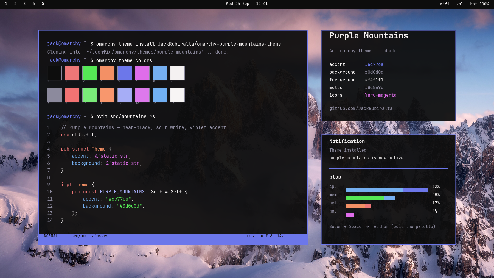

# Purple Mountains

A dark [Omarchy](https://omarchy.org) theme: near-black surfaces, soft white text and a violet-blue accent lifted from the purple-mountains wallpaper. Built with Aether, packaged as a standalone theme.



## Install

```sh
omarchy theme install https://github.com/JackRubiralta/omarchy-purple-mountains-theme
```

Or in Omarchy: **Super + Space → Install → Style → Theme** and paste the URL above. The theme shows up as **purple-mountains** in the theme switcher.

## Palette

| Role | Hex | | Role | Hex |
|---|---|---|---|---|
| background | `#0d0d0d` | | accent | `#6c77ea` |
| foreground | `#f4f1f1` | | selection | `#2c3040` |
| muted | `#8c8a9d` | | lighter background | `#24242e` |
| red | `#ee7777` | | bright red | `#f48f8f` |
| green | `#6fdd7f` | | bright green | `#8de89a` |
| yellow | `#f2cc7a` | | bright yellow | `#f6d78f` |
| blue | `#6c77ea` | | bright blue | `#a6adf6` |
| magenta | `#df6dea` | | bright magenta | `#e58cf0` |
| cyan | `#72bdf0` | | bright cyan | `#8ac9f4` |
| orange | `#f39065` | | brown | `#915353` |

Everything else (terminals, btop, Neovim via aether.nvim, the Omarchy shell, Hyprland borders, Chromium, VS Code, Obsidian, …) is generated by Omarchy from `colors.toml`.

## Optional: glass mode (window transparency)

Omarchy doesn't let a git-installed theme change Hyprland settings, so window transparency is a small snippet you add yourself. Paste it at the end of `~/.config/hypr/looknfeel.lua`. Hyprland reloads when you save.

```lua
-- Transparency multipliers.
--
-- transparency_multiplier (m): terminals and most apps (Omarchy's
-- default-opacity tag). focused = 100 - 2.5*m %, unfocused = 100 - 4*m %
--   m = 1 → 97.5 % / 96 %  (default: about the same as stock Omarchy)
--   m = 3 → 92.5 % / 88 %  (glass mode)
--   m = 0 → fully solid. Keep m below 25 (unfocused windows reach 0 % there).
--
-- solid_transparency_multiplier (s): apps Omarchy keeps solid when focused
-- (browsers, video players, games, Steam, …). Focused stays 100 %,
-- unfocused = 100 - 2.5*s %
--   s = 0.6 → 98.5 %  (default: stock Omarchy's browser fade)
--   s = 2   → 95 %    (glass mode)
--   s = 0   → fully solid.
local transparency_multiplier = 1
local solid_transparency_multiplier = 0.6

-- Catch-all first, so it only sticks on windows the default-opacity rule
-- below doesn't match (later rules win). Both rules also match class and
-- title so Hyprland re-runs them together whenever a window's title
-- changes; without that, terminals flicker between the two values.
o.window({ class = ".*", title = ".*" }, {
  opacity = string.format("1.0 %.3f", (100 - 2.5 * solid_transparency_multiplier) / 100),
})
o.window({ class = ".*", title = ".*", tag = "default-opacity" }, {
  opacity = string.format("%.3f %.3f",
    (100 - 2.5 * transparency_multiplier) / 100,
    (100 - 4 * transparency_multiplier) / 100),
})
```

Glass mode is `transparency_multiplier = 3` with `solid_transparency_multiplier = 2`.

The first multiplier covers terminals, file managers and most apps. The second covers everything Omarchy normally keeps solid (browsers, video players, games, Steam, image viewers, …). Those stay fully solid while you use them and only fade when you click away. Stock Omarchy keeps video players and games fully solid even when unfocused; this snippet gives them the same unfocused fade as browsers. **Super + Backspace** still toggles transparency for the focused window. For a frosted look, also turn on blur: `hl.config({ decoration = { blur = { enabled = true, size = 6, passes = 2 } } })`.

## What's inside

```
colors.toml          palette (Omarchy 4 semantic format)
icons.theme          Yaru-magenta
keyboard.rgb         keyboard backlight colour for supported laptops (accent)
backgrounds/         1-purple-mountains.jpg (the wallpaper), omarchy.webp (plain branded wallpaper in the palette)
unlock.png           lock-screen / boot-splash wordmark in the accent colour
preview.png          shown in the theme switcher and on themes.omarchy.org
preview-unlock.png   boot-splash thumbnail for the Plymouth unlock-screen switcher (generated with `omarchy plymouth preview`)
gtk.css              libadwaita named colours for GTK apps
```

Terminal configs, Neovim and VS Code are generated by Omarchy from `colors.toml` on install, so this repo does not ship them (Omarchy drops those files from git-installed themes anyway).

## Requirements

Omarchy 4 (Quattro) or newer. The theme is a `colors.toml` palette, which Omarchy 3 does not read.

## License and credits

Theme files are MIT licensed (see `LICENSE`). Wallpaper, wordmark and icon attributions are in [CREDITS.md](CREDITS.md).
